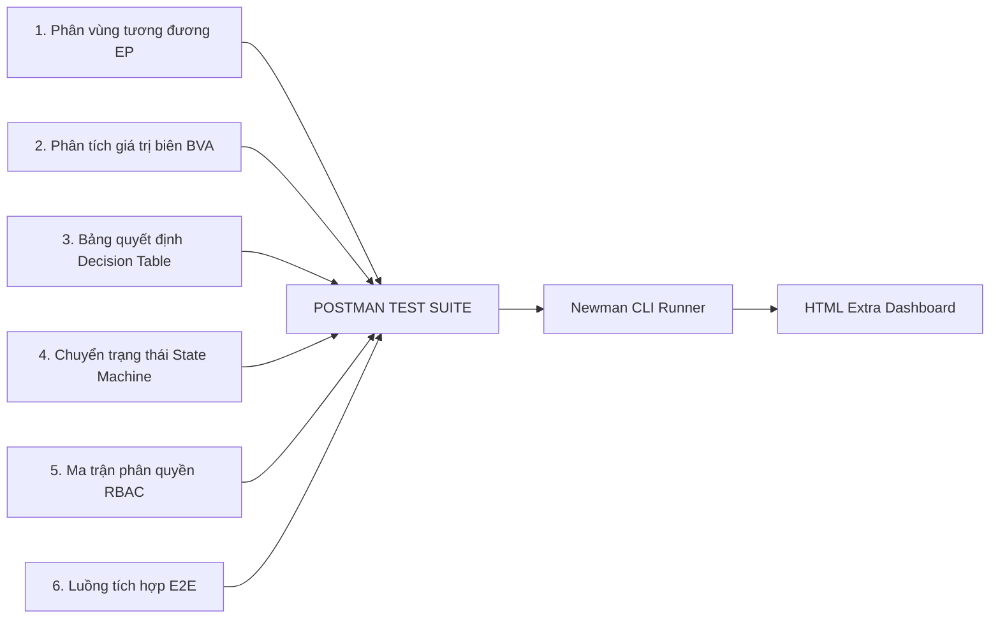

# KẾ HOẠCH KIỂM THỬ TỔNG THỂ (MASTER TEST PLAN)
**Tên dự án:** Kiểm thử Hệ thống RESTful API - Website Đặt Lịch Khám Phòng Khám Đa Khoa (MedClinic)  
**Môn học:** Kiểm thử phần mềm (Software Testing)  
**Công cụ kiểm thử chính:** Postman (Desktop App v10+), Newman (CLI), Node.js, PostgreSQL  
**Phương pháp tiếp cận:** Kiểm thử Hộp đen (Black-box Testing), Kiểm thử tự động API (API Automation Testing)

---

## 1. GIỚI THIỆU & MỤC TIÊU DỰ ÁN (INTRODUCTION & OBJECTIVES)

### 1.1. Giới thiệu
Tài liệu này xác định mục tiêu, phạm vi, chiến lược, môi trường, quy trình thực thi và tiêu chí nghiệm thu cho việc kiểm thử toàn diện hệ thống RESTful API của dự án Website Đặt Lịch Khám Phòng Khám Đa Khoa. Dự án đáp ứng các nghiệp vụ tương tác giữa Bệnh nhân (Patient), Bác sĩ (Doctor), Lễ tân/Thu ngân (Receptionist) và Quản trị hệ thống (Admin).

### 1.2. Mục tiêu kiểm thử (Testing Objectives)
* **Chức năng (Functional):** Xác nhận 100% các API xử lý lịch khám, hồ sơ bệnh án và lịch trình làm việc của bác sĩ hoạt động chính xác theo đặc tả nghiệp vụ y tế.
* **Biên & Ràng buộc (Boundary & Validation):** Kiểm tra khả năng ngăn chặn đặt trùng khung giờ (Overbooking), xử lý các khung thời gian sát giờ, tuổi bệnh nhân và dữ liệu đầu vào không hợp lệ.
* **Bảo mật & Phân quyền (Security & Access Control):** Đảm bảo cơ chế xác thực JWT và ma trận phân quyền (RBAC: Patient vs Doctor vs Receptionist vs Admin) hoạt động chặt chẽ, bảo vệ thông tin hồ sơ sức khỏe cá nhân (HIPAA/GDPR compliance basics).
* **Toàn vẹn dữ liệu (Data Integrity):** Kiểm tra tính nhất quán giữa trạng thái cuộc hẹn, lịch trống của bác sĩ và giao dịch thanh toán tạm ứng/phí khám.
* **Tự động hóa (Automation):** Xây dựng bộ kịch bản tự động hóa trên Postman kết hợp với Newman CLI để xuất báo cáo kiểm thử chuyên nghiệp (HTML Dashboard).

---

## 2. PHẠM VI KIỂM THỬ (SCOPE OF TESTING)

### 2.1. Trong phạm vi (In-Scope)
Kiểm thử toàn bộ các API Endpoints thuộc các module sau:
1. **Module 1 - Xác thực & Quản lý Tài khoản (`/api/auth`, `/api/users`):**
   - Đăng ký tài khoản bệnh nhân, đăng nhập, cấp phát và xác thực JWT token.
   - Quản lý hồ sơ cá nhân: Bệnh sử, thông tin bảo hiểm y tế, số điện thoại khẩn cấp.
   - Admin quản lý tài khoản nhân sự (Khóa/kích hoạt tài khoản bác sĩ/lễ tân, gán vai trò `ROLE_DOCTOR`, `ROLE_RECEPTIONIST`).
2. **Module 2 - Quản lý Chuyên khoa & Bác sĩ (`/api/specialties`, `/api/doctors`):**
   - Xem danh sách chuyên khoa, danh sách bác sĩ theo chuyên khoa, kinh nghiệm, học hàm/học vị.
   - Đánh giá/phản hồi của bệnh nhân về bác sĩ sau buổi khám.
   - CRUD danh mục chuyên khoa và thông tin bác sĩ (upload chứng chỉ/ảnh đại diện).
3. **Module 3 - Quản lý Ca làm việc & Ca khám (`/api/schedules`):**
   - Bác sĩ/Lễ tân đăng ký lịch làm việc theo ca (Sáng/Chiều/Tối) và phòng khám (`roomNo`).
   - Tự động chia ca làm việc thành các slot khám (mỗi slot 20-30 phút).
   - Truy vấn ca khám trống theo bác sĩ hoặc ngày khám.
4. **Module 4 - Quản lý Đặt lịch & Luồng Cuộc hẹn (`/api/appointments`):**
   - Bệnh nhân đặt lịch khám (Chọn chuyên khoa, bác sĩ, ngày, slot giờ, triệu chứng ban đầu).
   - Kiểm tra chống trùng ca (Prevent Concurrent Overbooking).
   - Bệnh nhân/Lễ tân hủy lịch hoặc yêu cầu đổi giờ (Reschedule).
   - Thay đổi trạng thái cuộc hẹn (`PENDING` $\to$ `CONFIRMED` $\to$ `CHECKED_IN` $\to$ `COMPLETED` / `CANCELLED`).
5. **Module 5 - Hồ sơ Bệnh án & Đơn thuốc (`/api/medical-records`):**
   - Bác sĩ cập nhật kết quả chẩn đoán, mã bệnh ICD-10 và kê đơn thuốc sau khi khám xong.
   - Bệnh nhân xem lịch sử khám và đơn thuốc điện tử.
6. **Module 6 - Thanh toán Phí khám (`/api/payments`):**
   - Khởi tạo hóa đơn phí dịch vụ khám.
   - Tích hợp callback thanh toán MoMo/VNPay Sandbox.
   - Xử lý hoàn phí/hủy giao dịch khi hủy lịch đúng quy định ($> 24$ giờ).
7. **Module 7 - Báo cáo & Thống kê Y tế (`/api/admin/reports`):**
   - Thống kê số lượng lượt khám theo chuyên khoa, doanh thu khám theo bác sĩ/tháng, tỷ lệ hủy lịch (No-show rate).

### 2.2. Ngoài phạm vi (Out-of-Scope)
- Kiểm thử giao diện Web/Mobile App (UI/UX Browser/Mobile Testing).
- Kiểm thử tải trọng cực hạn (Load Testing quy mô $> 10.000$ concurrent users).
- Tích hợp hệ thống xét nghiệm/chẩn đoán hình ảnh thực tế (LIS/PACS).

---

## 3. CHIẾN LƯỢC & KỸ THUẬT KIỂM THỬ (TEST STRATEGY & TECHNIQUES)

Mô hình kiểm thử tích hợp 6 kỹ thuật cốt lõi trên nền tảng Postman:



### 3.1. Phân vùng tương đương (Equivalence Partitioning - EP)
* **Ngày đặt lịch khám (`appointmentDate`):**
  - Vùng hợp lệ: Ngày ở tương lai (từ ngày hôm sau đến tối đa 30 ngày tới).
  - Vùng không hợp lệ: Ngày trong quá khứ, ngày hôm nay nhưng hết giờ làm việc, ngày vượt quá 30 ngày đặt trước.
* **Số BHYT (`insuranceCode`):**
  - Vùng hợp lệ: Chuỗi 15 ký tự đúng định dạng chuẩn BHXH Việt Nam (ví dụ: `DN4010123456789`).
  - Vùng không hợp lệ: Thừa/thiếu ký tự, chứa ký tự đặc biệt, mã tỉnh/thành không hợp lệ.

### 3.2. Phân tích giá trị biên (Boundary Value Analysis - BVA)
* **Thời gian hủy lịch được hoàn tiền:** Quy định hủy trước ca khám $\ge 24$ giờ:
  - Giá trị biên cần test (tính theo số phút trước giờ khám $T$): $1439$ phút ($23$h $59$p - Không hoàn tiền/mất phí), $1440$ phút ($24$h - Hoàn tiền 100% - Biên dưới), $1441$ phút ($24$h $01$p - Hoàn tiền 100%).
* **Số tuổi bệnh nhân đặt khám Nhi khoa (`age`):** Ràng buộc $0 \le \text{age} \le 15$:
  - Giá trị biên cần test: $-1$ (Lỗi), $0$ (Trẻ sơ sinh - Hợp lệ), $15$ (Hợp lệ - Biên trên), $16$ (Lỗi - Phải chuyển sang Nội tổng quát).

### 3.3. Kỹ thuật Bảng quyết định (Decision Table Testing)
Áp dụng cho API Đặt lịch khám (`POST /api/appointments/book`):
| Rule | Bác sĩ hoạt động | Ca khám trống | Bệnh nhân không bị trùng lịch | Tài khoản không bị khóa | Kết quả mong đợi (Status Code & Message) |
| :---: | :---: | :---: | :---: | :---: | :--- |
| **R1** | True | True | True | True | `201 Created` - Đặt lịch thành công, giữ slot |
| **R2** | False | - | - | - | `400 Bad Request` - Bác sĩ đã nghỉ phép/ngưng tác nghiệp |
| **R3** | True | False | - | - | `409 Conflict` - Khung giờ/slot này đã có người đặt |
| **R4** | True | True | False | - | `400 Bad Request` - Bệnh nhân đã có lịch khám khác trùng giờ |
| **R5** | True | True | True | False | `403 Forbidden` - Tài khoản bị tạm khóa do bùng lịch nhiều lần |

### 3.4. Kiểm thử chuyển trạng thái (State Transition Testing)
Áp dụng cho API Cập nhật trạng thái cuộc hẹn (`PUT /api/appointments/:id/status`):
* **Máy trạng thái cuộc hẹn:**
  - $S_1$: `Chờ xác nhận` (Pending)
  - $S_2$: `Đã xác nhận` (Confirmed)
  - $S_3$: `Đã check-in` (Checked-In)
  - $S_4$: `Đang khám` (In-Consultation)
  - $S_5$: `Hoàn thành` (Completed)
  - $S_6$: `Đã hủy` (Cancelled)
* **Ma trận chuyển trạng thái:**
  | Trạng thái hiện tại | Sự kiện / Yêu cầu chuyển đến | Kết quả mong đợi | Nghiệp vụ đi kèm |
  | :--- | :--- | :--- | :--- |
  | `Chờ xác nhận` | `Đã xác nhận` | `200 OK` (Hợp lệ) | Gửi SMS/Email xác nhận |
  | `Đã xác nhận` | `Đã check-in` | `200 OK` (Hợp lệ) | Lễ tân cấp số thứ tự vào phòng |
  | `Đã check-in` | `Đang khám` | `200 OK` (Hợp lệ) | Bác sĩ mở hồ sơ khám |
  | `Đang khám` | `Hoàn thành` | `200 OK` (Hợp lệ) | Lưu đơn thuốc và hóa đơn |
  | `Đã xác nhận` | `Đã hủy` | `200 OK` (Hợp lệ) | Giải phóng slot ca khám |
  | `Đang khám` | `Đã hủy` | `400 Bad Request` (Bất hợp lệ) | Không được hủy khi đang khám |
  | `Hoàn thành` | `Đã hủy` | `400 Bad Request` (Bất hợp lệ) | Không thể hủy lịch đã hoàn thành |

### 3.5. Ma trận kiểm thử phân quyền (RBAC Security Testing)
Xác thực quyền truy cập đối với 4 loại Token (`adminToken`, `doctorToken`, `receptionistToken`, `patientToken`) và trường hợp Không Token (`No Auth`):
| API Endpoint | Method | No Auth | Patient Token | Doctor Token | Receptionist | Admin Token |
| :--- | :---: | :---: | :---: | :---: | :---: | :---: |
| `/api/doctors` | GET | `200 OK` | `200 OK` | `200 OK` | `200 OK` | `200 OK` |
| `/api/appointments/book` | POST | `401 Unauth` | `201 Created` | `403 Forbidden` | `201 Created` | `201 Created` |
| `/api/medical-records` | POST | `401 Unauth` | `403 Forbidden` | `201 Created` | `403 Forbidden` | `403 Forbidden` |
| `/api/appointments/:id/checkin` | PUT | `401 Unauth` | `403 Forbidden` | `403 Forbidden` | `200 OK` | `200 OK` |
| `/api/doctors` | POST | `401 Unauth` | `403 Forbidden` | `403 Forbidden` | `403 Forbidden` | `201 Created` |
| `/api/admin/reports/revenue` | GET | `401 Unauth` | `403 Forbidden` | `403 Forbidden` | `403 Forbidden` | `200 OK` |

### 3.6. Kiểm thử tích hợp chuỗi nghiệp vụ (End-to-End Workflow)
Tạo kịch bản chạy liên hoàn tự động trên Postman thông qua biến môi trường động (Dynamic Variable Chaining):
1. **Request 1:** Đăng ký tài khoản Bệnh nhân mới với email ngẫu nhiên `{{$randomEmail}}`.
2. **Request 2:** Đăng nhập tài khoản Bệnh nhân vừa tạo $\to$ Lưu `patientToken`.
3. **Request 3:** Lấy danh sách Chuyên khoa $\to$ Chọn "Khoa Tim Mạch" $\to$ Lưu `specialtyId`.
4. **Request 4:** Tìm lịch làm việc trống của bác sĩ theo `specialtyId` $\to$ Lưu `doctorId`, `scheduleId`, `slotTime`.
5. **Request 5:** Đặt lịch khám $\to$ Kiểm tra phản hồi trả về `201 Created` $\to$ Lưu `appointmentId`.
6. **Request 6:** Lễ tân đăng nhập (`receptionistToken`) $\to$ Đổi trạng thái sang `CHECKED_IN`.
7. **Request 7:** Bác sĩ đăng nhập (`doctorToken`) $\to$ Đổi trạng thái sang `IN_CONSULTATION` $\to$ Tạo đơn thuốc & Kết luận bệnh án.
8. **Request 8:** Bác sĩ kết thúc ca khám $\to$ Đổi trạng thái cuộc hẹn sang `COMPLETED`.
9. **Request 9:** Truy vấn lại slot ca khám ban đầu $\to$ Khẳng định: Slot thời gian đã được ghi nhận trạng thái "Đã sử dụng/Đã đóng".

---

## 4. MÔI TRƯỜNG & CẤU HÌNH KIỂM THỬ (TEST ENVIRONMENT)

### 4.1. Thông số kỹ thuật môi trường
* **Hệ điều hành:** Windows 10/11 x64 hoặc macOS / Linux.
* **Server Backend:** Node.js v18+, Express v4.18+, chạy trên cổng local `http://localhost:5000`.
* **Cơ sở dữ liệu:** PostgreSQL 14+, Database: `clinic_booking_db`.
* **Công cụ Test:**
  - Postman Desktop Client (v10.x trở lên).
  - Node CLI Tools: `newman` (v5.x trở lên), `newman-reporter-htmlextra`.

### 4.2. Biến môi trường Postman (Postman Environment Variables)
| Tên biến | Kiểu dữ liệu | Mô tả / Giá trị mẫu |
| :--- | :--- | :--- |
| `baseUrl` | String | `http://localhost:5000/api` |
| `adminToken` | Secret | JWT Token của tài khoản Admin |
| `doctorToken` | Secret | JWT Token của Bác sĩ |
| `receptionistToken` | Secret | JWT Token của Lễ tân |
| `patientToken` | Secret | JWT Token của Bệnh nhân |
| `tempSpecialtyId` | Number | ID Chuyên khoa dùng trong luồng test |
| `tempDoctorId` | Number | ID Bác sĩ chọn để test |
| `tempAppointmentId` | String/UUID | Mã cuộc hẹn khởi tạo từ test case đặt lịch |
| `tempSlotId` | Number | ID slot giờ khám |

---

## 5. TIÊU CHUẨN KỊCH BẢN KIỂM THỬ TRÊN POSTMAN

Mỗi request trong Postman Collection bắt buộc phải tuân thủ cấu trúc 4 tầng kiểm tra:

```javascript
// ==================== TẦNG 1: KIỂM TRA MÃ TRẠNG THÁI HTTP ====================
pm.test("Status code is 201 Created", function () {
    pm.response.to.have.status(201);
});

// ==================== TẦNG 2: KIỂM TRA THỜI GIAN PHẢN HỒI ====================
pm.test("Response time is under 400ms", function () {
    pm.expect(pm.response.responseTime).to.be.below(400);
});

// ==================== TẦNG 3: KIỂM TRA HEADER & CONTENT-TYPE =================
pm.test("Content-Type is application/json", function () {
    pm.expect(pm.response.headers.get("Content-Type")).to.include("application/json");
});

// ==================== TẦNG 4: KIỂM TRA CẤU TRÚC JSON & DỮ LIỆU NGHIỆP VỤ =====
pm.test("Verify appointment booking payload structure", function () {
    const res = pm.response.json();
    
    // Kiểm tra cấu trúc thuộc tính
    pm.expect(res).to.have.property("success").that.is.true;
    pm.expect(res).to.have.property("data");
    
    // Kiểm tra logic nghiệp vụ cuộc hẹn y tế
    if (res.data.appointmentId) {
        pm.expect(res.data.status).to.eql("PENDING");
        pm.expect(res.data).to.have.property("doctorName");
        // Gán mã cuộc hẹn vào biến môi trường phục vụ request tiếp theo
        pm.environment.set("tempAppointmentId", res.data.appointmentId);
    }
});
```

---

## 6. QUY TRÌNH QUẢN LÝ LỖI (DEFECT MANAGEMENT)

### 6.1. Vòng đời của lỗi (Bug Life Cycle)
$$\text{New} \longrightarrow \text{Assigned} \longrightarrow \text{In Progress} \longrightarrow \text{Resolved} \longrightarrow \text{Verified (Re-test)} \longrightarrow \text{Closed}$$

### 6.2. Phân loại mức độ nghiêm trọng (Defect Severity)
* **S1 - Fatal / Blocker:** Trùng lịch khám cho 2 bệnh nhân cùng một slot (Overbooking), API lộ thông tin bệnh án giữa các bệnh nhân khác nhau, server sập (500 Unhandled Exception).
* **S2 - Critical:** Bác sĩ chưa khám nhưng trạng thái tự động thành completed, lỗi RBAC (Bệnh nhân tự kê đơn thuốc hoặc can thiệp thông tin bác sĩ).
* **S3 - Major:** Sai lệch số tiền tạm ứng/hoàn phí khi hủy lịch, bộ lọc bác sĩ theo chuyên khoa hoạt động sai, gửi mail nhắc lịch không đúng giờ.
* **S4 - Minor:** Thông báo lỗi thiếu tiếng Việt/thông điệp mờ nhạt, sai định dạng múi giờ (UTC vs GMT+7).

---

## 7. TIÊU CHÍ NGHIỆM THU (EXIT & ACCEPTANCE CRITERIA)

Dự án kiểm thử được đánh giá là hoàn thành và đạt yêu cầu môn học khi thỏa mãn đồng thời các điều kiện sau:
1. **Độ bao phủ:** 100% các API trong danh mục In-Scope đều có Test Suite tương ứng trên Postman.
2. **Tỷ lệ vượt qua (Pass Rate):** Đạt tối thiểu **95%** tổng số test cases.
3. **Mức độ lỗi còn tồn đọng:**
   - **0 lỗi S1 (Fatal/Blocker).**
   - **0 lỗi S2 (Critical).**
   - Các lỗi S3/S4 còn lại (nếu có) phải có biên bản ghi nhận và giải trình nguyên nhân.
4. **Tự động hóa & Báo cáo:**
   - Bộ Test Collection có khả năng chạy độc lập thông qua lệnh `newman run` mà không cần can thiệp thủ công.
   - Xuất đầy đủ file báo cáo HTML (`Clinic_API_Test_Report.html`) có hiển thị thống kê tổng quan, biểu đồ và chi tiết từng request.

---

## 8. HƯỚNG DẪN THỰC THI TỰ ĐỘNG BẰNG NEWMAN

### 8.1. Lệnh thực thi cơ bản
```bash
newman run tests/postman/ClinicBooking.postman_collection.json \
  -e tests/postman/ClinicBooking.postman_environment.json \
  --reporters cli
```

### 8.2. Lệnh thực thi Data-Driven Testing (kèm file dữ liệu CSV) và xuất báo cáo HTML:
```bash
newman run tests/postman/ClinicBooking.postman_collection.json \
  -e tests/postman/ClinicBooking.postman_environment.json \
  -d tests/postman/data/appointment_test_data.csv \
  --reporters cli,htmlextra \
  --reporter-htmlextra-export reports/Clinic_API_Test_Report.html \
  --reporter-htmlextra-title "Báo Cáo Kiểm Thử Tự Động API - Đặt Lịch Khám MedClinic" \
  --reporter-htmlextra-browserTitle "MedClinic API Test Report"
```